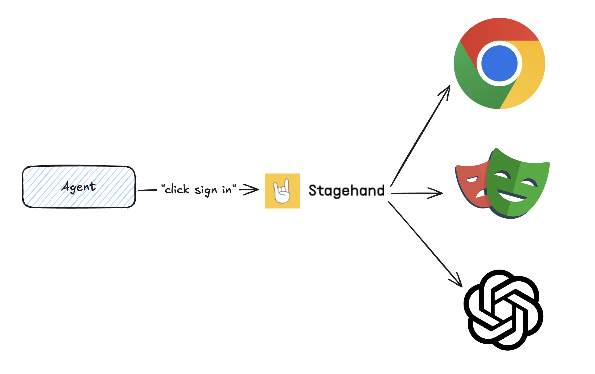
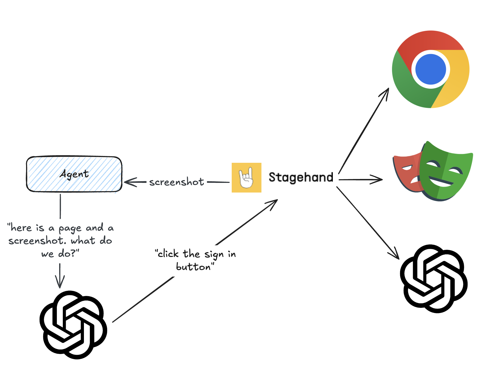

# Open Operator

> [!WARNING]
> This is simply a proof of concept.
> Browserbase aims NOT to compete with web agents, but rather to provide all the necessary tools for anybody to build their own web agent. We strongly recommend you check out both [Browserbase](https://www.browserbase.com) and our open source project [Stagehand](https://www.stagehand.dev) to build your own web agent.

[](https://vercel.com/new/clone?repository-url=https%3A%2F%2Fgithub.com%2Fbrowserbase%2Fopen-operator&env=OPENAI_API_KEY,BROWSERBASE_API_KEY,BROWSERBASE_PROJECT_ID&envDescription=API%20keys%20needed%20to%20run%20Open%20Operator&envLink=https%3A%2F%2Fgithub.com%2Fbrowserbase%2Fopen-operator%23environment-variables)

## Features

- 🌐 Autonomous web browsing and interaction
- 🤖 Natural language interface for web navigation
- 🔄 Real-time browser state synchronization
- 🛠️ Extensible architecture for custom actions
- 📱 Responsive design for all devices
- 🎭 Reliable browser automation with Stagehand
- 🔍 Precise DOM understanding and manipulation

## Getting Started

First, install the dependencies:

```bash
npm install
# or
yarn install
# or
pnpm install
```

Next, copy the example environment variables:

```bash
cp .env.example .env.local
```

You'll need to set up your API keys:

1. Get your OpenAI API key from [OpenAI's dashboard](https://platform.openai.com/api-keys)
2. Get your Browserbase API key and project ID from [Browserbase](https://www.browserbase.com)

Update `.env.local` with your API keys:

- `OPENAI_API_KEY`: Your OpenAI API key
- `BROWSERBASE_API_KEY`: Your Browserbase API key
- `BROWSERBASE_PROJECT_ID`: Your Browserbase project ID

Then, run the development server:

```bash
npm run dev
# or
yarn dev
# or
pnpm dev
```

Open [http://localhost:3000](http://localhost:3000) with your browser to see Open Operator in action.

## How It Works

Building a web agent is a complex task. You need to understand the user's intent, convert it into headless browser operations, and execute actions, each of which can be incredibly complex on their own.


Stagehand is a tool that helps you build web agents. It allows you to convert natural language into headless browser operations, execute actions on the browser, and extract results back into structured data.



Under the hood, we have a very simple agent loop that just calls Stagehand to convert the user's intent into headless browser operations, and then calls Browserbase to execute those operations.



Stagehand uses Browserbase to execute actions on the browser, and OpenAI to understand the user's intent.

For more on this, check out the code at [this commit](https://github.com/browserbase/open-operator/blob/6f2fba55b3d271be61819dc11e64b1ada52646ac/index.ts).

### Key Technologies

- **[Browserbase](https://www.browserbase.com)**: Powers the core browser automation and interaction capabilities
- **[Stagehand](https://www.stagehand.dev)**: Handles precise DOM manipulation and state management
- **[Next.js](https://nextjs.org)**: Provides the modern web framework foundation
- **[OpenAI](https://openai.com)**: Enable natural language understanding and decision making

## Contributing

We welcome contributions! Whether it's:

- Adding new features
- Improving documentation
- Reporting bugs
- Suggesting enhancements

Please feel free to open issues and pull requests.

## License

Open Operator is open source software licensed under the MIT license.

## Acknowledgments

This project is inspired by OpenAI's Operator feature and builds upon various open source technologies including Next.js, React, Browserbase, and Stagehand.
